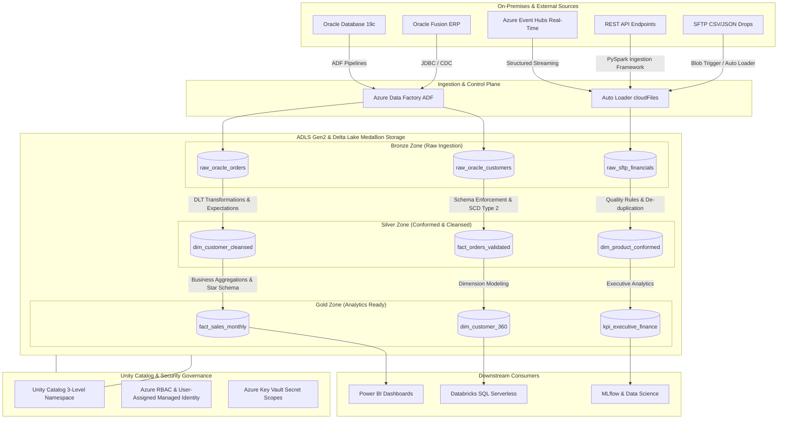

<div align="center">

# Azure Databricks Lakehouse Platform

### *Production-Grade Enterprise Medallion Architecture, Unity Catalog Governance, Delta Live Tables & Modular Terraform IaC*

[](https://azure.microsoft.com/en-us/products/databricks)
[](https://delta.io/)
[](https://www.terraform.io/)
[](https://www.databricks.com/product/unity-catalog)
[](LICENSE)
[](.github/workflows/terraform-ci.yml)

---

[Key Features](#-key-features) • [Architecture](#-platform-architecture) • [Directory Structure](#-repository-structure) • [Terraform Setup](#-infrastructure-as-code) • [Deployment](#-deployment-guide) • [Design Philosophy](#-design-philosophy) • [Roadmap](#-project-roadmap) • [Documentation](docs/)

</div>

---

## 🏛️ Executive Summary & Modernization Context

The **Azure Databricks Lakehouse Platform** is an open-source, production-grade enterprise data platform reference implementation. It models a high-impact consulting engagement: **modernizing an enterprise's legacy on-premises Oracle ERP footprint into a cloud-native Azure Databricks Lakehouse**.

### 💼 The Business Challenge
A global enterprise operating on **Oracle Fusion ERP**, **Oracle Database 19c**, legacy SFTP flat-file transfers, and fragmented REST APIs faces severe operational bottlenecks:
- **Scalability Limits**: Batch processing windows exceeding 14 hours for daily financial reconciliation.
- **Siloed Analytics**: Disjointed data warehouses causing inconsistent business metrics between Finance, Supply Chain, and Sales.
- **Governance Gaps**: Absence of centralized audit logs, PII dynamic data masking, and fine-grained access controls.

### 🚀 The Target Solution
This platform transitions the organization to a unified **Delta Lake Medallion Architecture** governed by **Unity Catalog** and orchestrated via **Azure Data Factory (ADF)** and **Delta Live Tables (DLT)**:
- **Bronze Zone (`raw`)**: Scalable Auto Loader ingestion preserving raw source payloads with ingestion metadata.
- **Silver Zone (`cleansed`)**: Conformed entities with automated schema enforcement, SCD Type 1 & 2 tracking, and DLT data quality expectations.
- **Gold Zone (`analytics`)**: Kimball star-schema dimensional models optimized for Databricks SQL Serverless and Power BI.
- **Automated Infrastructure**: 100% declarative Terraform modules across `dev`, `qa`, and `prod` environments.

---

## 📐 Platform Architecture



---

## ✨ Key Features & Engineering Guardrails

| Feature Area | Implementation Standards | Reference Doc |
| ------------ | ------------------------ | ------------- |
| **Infrastructure as Code** | Modular HCL with Terraform 1.7+, remote state locking on Azure Storage, multi-environment (`dev`/`qa`/`prod`) segregation. | [`deployment.md`](docs/deployment.md) |
| **Data Governance** | Databricks Unity Catalog 3-level namespace (`catalog.schema.table`) with managed-identity credential access. | [`security.md`](docs/security.md) |
| **Pipeline Framework** | Declarative Delta Live Tables (DLT) with PySpark/SQL, Auto Loader schema evolution, SCD Type 1/2 tracking. | [`architecture.md`](docs/architecture.md) |
| **Data Quality Enforcement** | DLT `@dlt.expect` quality contracts (`EXPECT`, `DROP ROW`, `FAIL UPDATE`) with event log tracking. | [`monitoring.md`](docs/monitoring.md) |
| **Observability & FinOps** | Unity Catalog System Tables (`system.billing`, `system.access`), Azure Log Analytics, cluster auto-scaling, Spot VMs. | [`cost-optimization.md`](docs/cost-optimization.md) |
| **CI/CD Automation** | GitHub Actions workflows for Markdown, Python (Ruff), YAML, Gitleaks secret scanning, and Terraform validation. | [`development.md`](docs/development.md) |

---

## 💻 Technology Stack

- **Cloud Platform**: Microsoft Azure
- **Data Engine**: Azure Databricks (Databricks Runtime 14.3 LTS, Photon Engine, Serverless SQL)
- **Storage Format**: Delta Lake 3.1 & Azure Data Lake Storage Gen2 (ADLS Gen2)
- **Governance**: Databricks Unity Catalog
- **Orchestration**: Azure Data Factory (ADF) & Delta Live Tables (DLT)
- **Infrastructure as Code**: Terraform (AzureRM Provider, Databricks Provider)
- **CI/CD**: GitHub Actions (Azure OIDC Federated Credentials planned for Phase 5)
- **Languages**: PySpark (Python 3.11), SQL, HCL, YAML, Bash

---

## 📂 Repository Structure

```text
Azure-Databricks-Lakehouse-Platform/
├── .github/                     # GitHub Workflows & Governance
│   ├── ISSUE_TEMPLATE/          # Structured Bug Report & Feature Request Forms
│   ├── workflows/               # CI/CD Workflows (Terraform, Ruff, Gitleaks, Linter)
│   ├── CODEOWNERS               # Component code ownership mapping
│   ├── PULL_REQUEST_TEMPLATE.md # Enterprise Pull Request Checklist
│   └── dependabot.yml           # Automated dependency update configuration
├── architecture/                # Visual Architecture Source & Export Files
│   ├── diagrams/                # Mermaid & PlantUML specs
│   ├── drawio/                  # Draw.io XML source files
│   └── exports/                 # High-resolution PNG/SVG assets
├── dashboards/                  # Databricks SQL & Power BI Dashboard Specs
├── docs/                        # Deep-Dive Architecture & Operations Documentation
│   ├── architecture.md          # End-to-End Reference Architecture Specification
│   ├── adr/                     # Architecture Decision Records (ADR-001..007)
│   ├── deployment.md            # Multi-Environment Deployment & Setup Guide
│   ├── development.md           # Developer Guide, PySpark Standards & Databricks Connect
│   ├── project-roadmap.md       # Strategic 5-Phase Engineering Roadmap
│   ├── monitoring.md            # Observability, System Tables & Data Quality Framework
│   ├── security.md              # Zero-Trust Security, VNet Injection & Unity Catalog
│   └── cost-optimization.md     # FinOps Playbook, Cluster Auto-scaling & Spot VMs
├── notebooks/                   # Medallion Architecture PySpark & SQL Notebooks
│   ├── bronze/                  # Raw ingestion notebooks & Auto Loader routines
│   ├── silver/                  # Cleansing, conformed logic, SCD Type 1/2
│   ├── gold/                    # Kimball star-schema aggregation notebooks
│   └── shared/                  # Common utility modules & metadata logging
├── pipelines/                   # Delta Live Tables (DLT) Pipeline Definitions
├── terraform/                   # Enterprise Infrastructure as Code (HCL)
│   ├── bootstrap/               # One-time Azure Remote State Storage & Lock setup
│   ├── modules/                 # Reusable Infrastructure Modules
│   │   ├── resource_group/      # Azure Resource Group with standard tags
│   │   ├── networking/          # VNet, Host Public/Private subnets, NSGs
│   │   ├── storage/             # ADLS Gen2 Hierarchical Storage Accounts & Containers
│   │   ├── key_vault/           # Azure Key Vault & Secret Scope integration
│   │   ├── databricks_workspace/# Databricks Premium Workspace with VNet Injection
│   │   └── unity_catalog/       # Metastore, Managed Identity, Catalogs & Schemas
│   └── environments/            # Environment Target Deployments
│       ├── dev/                 # Development Environment Specs
│       ├── qa/                  # QA / Staging Environment Specs
│       └── prod/                # Production Environment Specs
├── scripts/                     # Automation Shell Scripts & Databricks CLI Utils
├── sample-data/                 # Synthetic Data Schemas for Local Testing
├── tests/                       # PySpark Unit Tests (pytest & chispa)
├── README.md                    # Flagship Repository Overview
├── LICENSE                      # Apache 2.0 Open Source License
├── SECURITY.md                  # Vulnerability Reporting & Security Policies
├── CONTRIBUTING.md              # Developer Contribution Workflow & Git Guidelines
├── CODE_OF_CONDUCT.md           # Contributor Covenant Code of Conduct
└── CHANGELOG.md                 # Semantic Versioning Release Notes
```

---

## 🛠️ Infrastructure as Code (Terraform)

Infrastructure is managed modularly in [`terraform/`](terraform/). Modules separate cloud resource definitions into reusable building blocks:

```bash
# 1. Bootstrap Azure Remote State Storage Account
cd terraform/bootstrap
terraform init && terraform apply -var-file="terraform.tfvars"

# 2. Deploy Development Infrastructure Target
cd ../environments/dev
cp backend.tf.example backend.tf
cp terraform.tfvars.example terraform.tfvars
terraform init && terraform apply -var-file="terraform.tfvars"
```

---

## 🗺️ Project Roadmap

The platform follows a disciplined 5-Phase engineering lifecycle:

- [x] **Phase 1: Foundation & Governance** (Repository Skeleton, Architecture Specs, Governance, GitHub Workflows)
- [x] **Phase 2: Modular Infrastructure as Code** (Terraform Bootstrap, Modules, Unity Catalog & Multi-Env Deployments)
- [ ] **Phase 3: Medallion Data Pipelines** (Bronze Auto Loader, Silver Conformed DLT, Gold Star Schema Models)
- [ ] **Phase 4: Monitoring & Data Quality** (Unity Catalog System Tables, DLT Event Logging, Operational Alerts)
- [ ] **Phase 5: Automated CI/CD Deployment** (Azure OIDC GitHub Actions Deployment & Automated Testing)

For detailed milestone breakdown, see [`docs/project-roadmap.md`](docs/project-roadmap.md).

---

## 🧭 Design Philosophy

This is a governed-first lakehouse, not a generic data template. The full decision record is in [ADR-007](docs/adr/ADR-007-repository-design-philosophy.md).

- **Governance before pipelines** — Unity Catalog and identity are provisioned before any transformation exists.
- **Declarative and reviewable** — every environment is a code artifact; changes land via pull requests with checks.
- **Honest about scope** — documented controls are only those implemented; planned work lives in the roadmap, not in prose.
- **Medallion by default, with an escape hatch** — layered Bronze/Silver/Gold via DLT, plus plain PySpark/ADF where declarative tooling adds no value.
- **When NOT to use this architecture**: single-copy real-time serving, non-Azure deployments, or teams without the operational capacity for a governed lakehouse.

---

## 📄 License & Governance

Distributed under the **Apache 2.0 License**. See [`LICENSE`](LICENSE) for details.  
Review our [`SECURITY.md`](SECURITY.md), [`CONTRIBUTING.md`](CONTRIBUTING.md), and [`CODE_OF_CONDUCT.md`](CODE_OF_CONDUCT.md).
