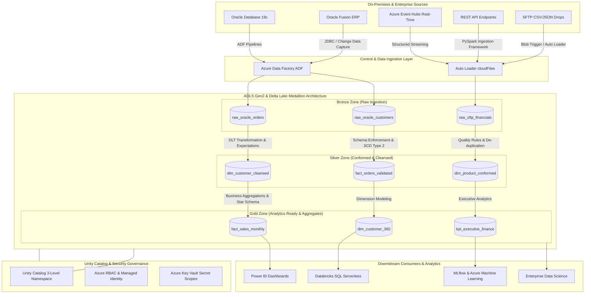

# Platform Architecture & Design Specification

## Executive Summary

The **Azure Databricks Lakehouse Platform** is an enterprise data engineering solution designed to modernize legacy on-premises Oracle ERP systems (Oracle Fusion ERP, Oracle Database 19c, SFTP flat files, REST APIs) into a modern, unified Lakehouse architecture on Microsoft Azure.

By unifying data engineering, data governance, operational analytics, and machine learning into a single platform built on **Delta Lake**, **Delta Live Tables (DLT)**, and **Unity Catalog**, this platform eliminates traditional data silos, guarantees ACID transactional integrity, enforces automated schema enforcement, and delivers analytics-ready datasets at petabyte scale.

---

## High-Level Architecture Topology



---

## Core Architectural Components

### 1. Source Systems & Ingestion
- **Oracle Fusion ERP & Oracle Database 19c**: Extract financial, supply chain, and customer master data using Azure Data Factory (ADF) pipeline orchestration with self-hosted integration runtimes (SHIR) and JDBC connectors. High-frequency updates are captured using Change Data Capture (CDC).
- **SFTP & REST APIs**: Semi-structured files (CSV, JSON, XML) arriving via SFTP landing zones are ingested continuously using **Databricks Auto Loader (`cloudFiles`)**, ensuring scalable, idempotent ingestion with automatic schema drift detection.
- **Azure Event Hubs**: High-throughput telemetry and clickstream event streams are captured using **Spark Structured Streaming** with checkpointing stored on ADLS Gen2.

### 2. Medallion Storage Architecture (ADLS Gen2)
The platform organizes data across three logical storage zones on Azure Data Lake Storage Gen2 (ADLS Gen2) using hierarchical namespace (HNS) and Delta Lake storage format:

- **Bronze Zone (`raw`)**: Append-only landing zone. Preserves raw source records with original data types, audit metadata columns (`_ingested_at`, `_source_file`, `_commit_id`), and raw payload JSON. Zero transformations applied.
- **Silver Zone (`cleansed` / `conformed`)**: Cleaned, deduplicated, validated, and conformed entities. Applies schema validation, string trim/null checks, date normalization, Slowly Changing Dimensions (SCD Type 1 and Type 2 tracking), and Data Quality expectations.
- **Gold Zone (`analytics`)**: Business-level star schema (Kimball methodology) containing dimensional entities (`dim_customer`, `dim_product`) and fact tables (`fact_sales`, `fact_financial_ledger`). Aggregated and optimized for high-performance querying in Power BI and Databricks SQL Serverless.

### 3. Unity Catalog Governance Model
Governance is structured around Unity Catalog's 3-level namespace: `catalog.schema.table`.

```text
prod_lakehouse (Catalog)
├── bronze (Schema)
│   ├── oracle_fusion_orders
│   └── sftp_financial_records
├── silver (Schema)
│   ├── dim_customer
│   └── fact_sales_cleansed
└── gold (Schema)
    ├── dim_customer_360
    └── fact_monthly_revenue
```

- **Storage Credentials & External Locations**: Storage credentials use Azure Managed Identity (User-Assigned) to grant access to ADLS Gen2 storage paths without passing storage keys.
- **Row & Column Level Security**: Dynamic data masking functions (e.g., masking PII fields like SSN, Email) and row-level filters enforced based on user identity or group membership (`IS_ACCOUNT_GROUP_MEMBER()`).

---

## Data Pipeline Framework (Delta Live Tables & PySpark)

The processing framework leverages **Delta Live Tables (DLT)** for declarative pipeline execution:
- **Declarative ETL**: Pipelines define flow dependencies using SQL or PySpark DLT `@dlt.table` decorators.
- **Data Quality Expectations**: Expectations (`ON VIOLATION DROP ROW`, `ON VIOLATION FAIL UPDATE`, `EXPECT (condition)`) enforce strict data quality contracts before promoting records from Bronze to Silver.
- **Auto-Maintenance**: DLT automatically handles Delta Lake maintenance tasks including `OPTIMIZE`, Z-Ordering, and `VACUUM`.
