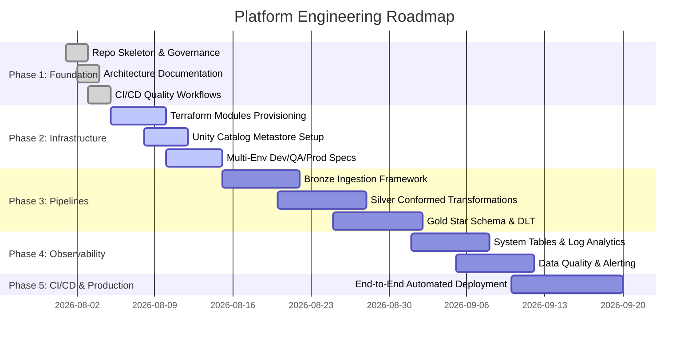

# Enterprise Project Roadmap

## Strategic Vision

The **Azure Databricks Lakehouse Platform** roadmap outlines a multi-phase engineering trajectory designed to deliver an enterprise-grade, scalable, governed data platform.

---

## Roadmap Phases

---

## Detailed Milestone Deliverables

### Phase 1: Foundation & Governance (Completed Baseline)
- [x] Repository directory structure according to enterprise standards.
- [x] Comprehensive documentation suite (`architecture.md`, `deployment.md`, `development.md`, etc.).
- [x] Governance policies (`SECURITY.md`, `CONTRIBUTING.md`, `CODE_OF_CONDUCT.md`, `LICENSE`).
- [x] GitHub CI workflows for Markdown, Python (Ruff), YAML, Gitleaks Secret Scanning, and Terraform validation.

### Phase 2: Modular Infrastructure as Code (Terraform) (In Progress / Completed)
- [x] One-time Azure remote state bootstrap module.
- [x] Reusable Terraform modules: `resource_group`, `networking`, `storage`, `key_vault`, `databricks_workspace`, `unity_catalog`.
- [x] Environment target configurations for `dev`, `qa`, and `prod`.
- [x] Unity Catalog metastore, Access Connector (Managed Identity), storage credentials, external locations, catalogs, and medallion schemas.

### Phase 3: Medallion Data Pipelines & Delta Live Tables (Target Phase 3)
- [ ] PySpark & Delta Live Tables (DLT) framework for Bronze Auto Loader ingestion (Oracle Fusion ERP, SFTP, REST APIs).
- [ ] Silver layer conformed transformations, SCD Type 1/2 tracking, and schema validation.
- [ ] Gold layer star schema modeling (`fact_sales`, `dim_customer_360`, `kpi_financials`).

### Phase 4: Monitoring, Observability & Data Quality (Target Phase 4)
- [ ] Databricks System Tables queries for billing, cluster performance, and audit tracking.
- [ ] Integration with Azure Log Analytics workspace and Grafana / Databricks SQL dashboards.
- [ ] DLT event log parsing and Slack / Microsoft Teams incident alerting.

### Phase 5: End-to-End Release & Production Readiness (Target Phase 5)
- [ ] GitHub Actions OIDC automated Terraform deployment pipelines (`plan` on PR, `apply` on merge).
- [ ] Automated notebook integration test execution against Databricks staging workspace.
- [ ] Platform operational runbooks and performance benchmarks.
