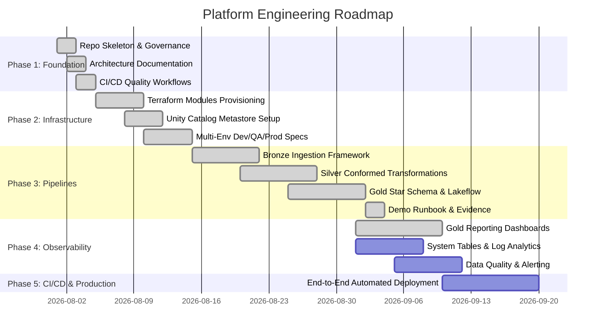

# Enterprise Project Roadmap

## Strategic Vision

The platform roadmap is a 5-phase engineering trajectory. Phases 1 and 2 are complete, Phase 3 (the medallion pipelines) is implemented and executing against a live workspace, and the remaining phases are tracked here.

---

## Roadmap Phases

---

## Detailed Milestone Deliverables

### Phase 1: Foundation & Governance (Completed)
- [x] Repository directory structure according to enterprise standards.
- [x] Documentation suite (`architecture.md`, `deployment.md`, `development.md`, etc.).
- [x] Governance policies (`SECURITY.md`, `CONTRIBUTING.md`, `CODE_OF_CONDUCT.md`, `LICENSE`).
- [x] GitHub CI workflows for Markdown, Python (Ruff), YAML, Gitleaks Secret Scanning, and Terraform validation.

### Phase 2: Modular Infrastructure as Code (Terraform) (Completed)
- [x] One-time Azure remote state bootstrap module.
- [x] Reusable Terraform modules: `resource_group`, `networking`, `storage`, `key_vault`, `databricks_workspace`, `unity_catalog`.
- [x] Shared environment wrapper module with thin `dev`, `qa`, and `prod` roots.
- [x] Unity Catalog metastore, Access Connector (Managed Identity), storage credentials, external locations, catalogs, and medallion schemas.
- [x] AzureRM provider upgraded to `~> 5.0` with regenerated lock files.

### Phase 3: Medallion Data Pipelines & Lakeflow Declarative Pipelines (Implemented)
- [x] PySpark & Lakeflow Declarative Pipelines framework for Bronze Auto Loader ingestion. Declarative Bronze manifest (`pipelines/energy/bronze_manifest.json`), shared Auto Loader helpers (`notebooks/shared/`), and a data-driven Lakeflow notebook (`notebooks/bronze/ingest_energy.py`). Reference sources are the synthetic generator's landing files; Oracle/SFTP/REST wiring is out of scope for this reference platform.
- [x] Silver layer conformed transformations, SCD Type 1 **and** SCD Type 2, and schema validation. Declarative Silver manifest (`pipelines/energy/silver_manifest.json`), conforming helpers (`notebooks/shared/silver.py`), and a data-driven Lakeflow notebook (`notebooks/silver/transform_energy.py`). Tables default to SCD Type 1 upserts; `customers` and `assets` opt into SCD Type 2 (`track_by` — manifest key `track_history_column_list` — + `stored_as_scd_type=2`) to preserve historical versions of lifecycle attributes. The SCD2 semantics contract is pinned in pure Python by `notebooks/shared/scd2.py` + `tests/test_scd2.py`, so CI verifies the behavior the Lakeflow engine must produce (initial version, close/open on tracked change, one current version, no history on repeats).
- [x] Gold layer star schema modeling. Declarative Gold manifest (`pipelines/energy/gold_manifest.json`) with 9 Kimball dimensions, a generated date dimension, and 4 facts with derived date keys and aggregations; helpers (`notebooks/shared/gold.py`, `notebooks/shared/gold_manifest.py`); a data-driven Lakeflow notebook (`notebooks/gold/transform_energy.py`) using fail-on-violation quality expectations.
- [x] Gold reporting dashboards (Databricks AI/BI / Lakeview) deployed from the Databricks Asset Bundle (`bundle/resources/energy_operations.dashboard.yml` + `bundle/src/energy_operations.lvdash.json`) on top of the Gold star schema. **NorthGrid Energy Operations** is deployed and live in dev.

### Phase 4: Monitoring, Observability & Data Quality (Not Started)
- [ ] Databricks System Tables queries for billing, cluster performance, and audit tracking.
- [ ] Integration with Azure Log Analytics workspace and Databricks SQL dashboards.
- [ ] Pipeline event log parsing and Slack / Microsoft Teams incident alerting.

### Phase 5: End-to-End Release & Production Readiness (In Progress)
- [x] Databricks Asset Bundle packaging for the Lakeflow pipelines and dashboard (`bundle/databricks.yml`, targets `dev`/`qa`/`prod`) with a branch-driven `Databricks Bundle CI/CD` workflow and offline structural validation (`scripts/validate_bundle.py`); live workspace validate/deploy steps are gated on credentials and become active with OIDC below.
- [x] Workspace deployment through Databricks Asset Bundles: the `energy_lakehouse` pipeline executes successfully against a live workspace and the AI/BI dashboard is deployed on the resulting data.
- [ ] GitHub Actions OIDC automated Terraform deployment pipelines (`plan` on PR, `apply` on merge).
- [ ] Automated notebook integration test execution against Databricks staging workspace.
- [ ] Platform operational runbooks (demo runbook shipped at `docs/demo/runbook.md`; production runbooks remain) and performance benchmarks (Milestone C below).

---

## Release Strategy

Every release corresponds to implemented functionality. The next release is
the **End-to-End Lakehouse Reference Implementation** (candidate `v0.3.0`):
the platform is working software — data generation through deployed dashboards —
rather than a design repository.

| Version | Milestone | Content | Status |
| ------- | --------- | ------- | ------ |
| v0.2.0 | Foundation Complete | Architecture decisions, Terraform IaC, CI/CD, consolidated documentation. | Released 2026-08-02 |
| **v0.3.0** | **End-to-End Lakehouse Reference Implementation** | Synthetic enterprise data generator, Energy reference implementation, Bronze/Silver/Gold with SCD Type 1 **and** SCD Type 2, quality expectations, Databricks Asset Bundles deployment, CI/CD, 138 tests, deployed AI/BI dashboard, demo runbook. | **Candidate** — next release (see CHANGELOG) |
| v0.4.0 | Observability Foundation | Pipeline run metrics, run/task visibility, freshness, basic alerts (Milestone A). | Planned |
| v0.5.0 | Data Quality Failure Scenarios | Controlled bad-data demos: expectation → event log → operator visibility (Milestone B). | Planned |
| v0.6.0 | Performance / Cost Analysis | Baseline vs optimized measurements on real runs (Milestone C). | Planned |
| v0.7.0 | Production Readiness Review | Security/identity/networking/secrets/CI/CD/testing/quality/observability/cost/scalability/recovery review (Milestone D). | Planned |
| v1.0.0 | Enterprise Lakehouse Platform | Depends on the Milestone E decision; not calendar-driven. | Deferred |

## Future Milestone Backlog

Purpose: a deliberate, meaningful cadence rather than feature sprawl. Each
milestone is a full engineering unit; none are scheduled as weekly
deliverables.

- **Milestone A — Observability foundation**: pipeline run metrics, task/run
  visibility, operational metadata, execution duration, row counts, failure
  visibility, freshness, basic alerts — Databricks-native capabilities only.
- **Milestone B — Data quality failure scenarios**: controlled bad-data
  inputs (invalid FK, null required field, invalid domain value, duplicate
  business key, malformed record) demonstrating bad input → quality
  expectation → visibility/event log → operator identifies the issue.
- **Milestone C — Performance / cost analysis**: a small measurable
  optimization exercise (partitioning, file sizes, clustering, unnecessary
  scans, compute sizing) with only actually-executed measurements.
- **Milestone D — Production readiness review**: structured findings over
  security, identity, networking, secrets, CI/CD, testing, data quality,
  observability, cost, scalability, recovery, operational ownership.
- **Milestone E — Phase 4 / advanced capabilities**: only after A–D, based on
  portfolio and consulting value. No technology additions (Kafka, dbt,
  Airflow, Snowflake, Power BI, Grafana, Kubernetes, ML pipelines, GenAI)
  without an explicit architecture decision.
