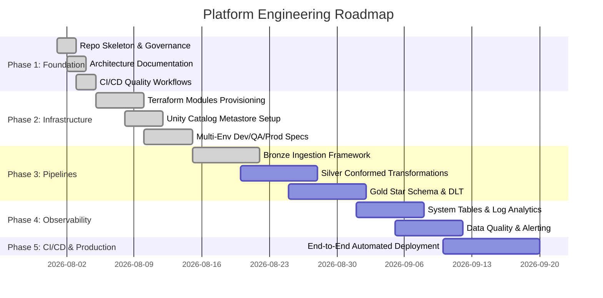

# Enterprise Project Roadmap

## Strategic Vision

The platform roadmap is a 5-phase engineering trajectory. Phases 1 and 2 are complete; implementation of the remaining phases is tracked here.

---

## Roadmap Phases

---

## Detailed Milestone Deliverables

### Phase 1: Foundation & Governance (Completed)
- [x] Repository directory structure according to enterprise standards.
- [x] Documentation suite (`architecture.md`, `deployment.md`, `development.md`, etc.).
- [x] Governance policies (`SECURITY.md`, `CONTRIBUTING.md`, `CODE_OF_CONDUCT.md`, `LICENSE`).
- [x] GitHub CI workflows for Markdown, Python (Ruff), YAML, Gitleaks Secret Scanning, and Terraform validation.

### Phase 2: Modular Infrastructure as Code (Terraform) (Completed)
- [x] One-time Azure remote state bootstrap module.
- [x] Reusable Terraform modules: `resource_group`, `networking`, `storage`, `key_vault`, `databricks_workspace`, `unity_catalog`.
- [x] Shared environment wrapper module with thin `dev`, `qa`, and `prod` roots.
- [x] Unity Catalog metastore, Access Connector (Managed Identity), storage credentials, external locations, catalogs, and medallion schemas.
- [x] AzureRM provider upgraded to `~> 5.0` with regenerated lock files.

### Phase 3: Medallion Data Pipelines & Delta Live Tables (Target Phase 3)
- [x] PySpark & Delta Live Tables (DLT) framework for Bronze Auto Loader ingestion (Oracle Fusion ERP, SFTP, REST APIs). Framework delivered: declarative Bronze manifest (`pipelines/energy/bronze_manifest.json`), shared Auto Loader helpers (`notebooks/shared/`), and a data-driven DLT notebook (`notebooks/bronze/ingest_energy.py`); wiring to real Oracle/SFTP/REST sources remains Phase 3.
- [ ] Silver layer conformed transformations, SCD Type 1/2 tracking, and schema validation.
- [ ] Gold layer star schema modeling (`fact_sales`, `dim_customer_360`, `kpi_financials`).

### Phase 4: Monitoring, Observability & Data Quality (Target Phase 4)
- [ ] Databricks System Tables queries for billing, cluster performance, and audit tracking.
- [ ] Integration with Azure Log Analytics workspace and Grafana / Databricks SQL dashboards.
- [ ] DLT event log parsing and Slack / Microsoft Teams incident alerting.

### Phase 5: End-to-End Release & Production Readiness (Target Phase 5)
- [ ] GitHub Actions OIDC automated Terraform deployment pipelines (`plan` on PR, `apply` on merge).
- [ ] Automated notebook integration test execution against Databricks staging workspace.
- [ ] Platform operational runbooks and performance benchmarks.

---

## Release Strategy

Every release corresponds to implemented functionality. Documentation-only releases stop at v0.2.0; milestones below are indicative and evolve as implementation progresses.

| Version | Milestone | Content |
| ------- | --------- | ------- |
| v0.2.0 | Foundation Complete | Architecture decisions, Terraform IaC, CI/CD, consolidated documentation. *(current)* |
| v0.3.0 | Terraform Infrastructure | First end-to-end apply; Databricks NSG rule set; workspace validation. |
| v0.4.0 | Bronze Layer Implementation | Auto Loader ingestion for Oracle ERP, SFTP, and REST sources. |
| v0.5.0 | Silver Layer & CDC | Conformed transformations, SCD Type 1/2, change data capture. |
| v0.6.0 | Gold Layer & Business Models | Star-schema models and business analytics tables. |
| v0.7.0 | Monitoring & Data Quality | System tables, DLT event logs, alerting, dashboards. |
| v0.8.0 | CI/CD & Deployment | OIDC automated plan/apply pipelines. |
| v0.9.0 | Performance Optimization | Cluster tuning, Photon, lifecycle and cost controls. |
| v1.0.0 | Enterprise Lakehouse Platform | Production-ready platform. |
